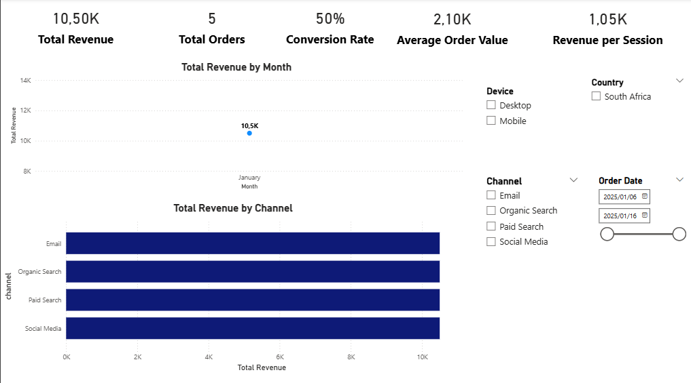
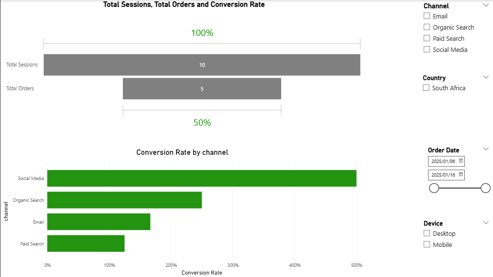
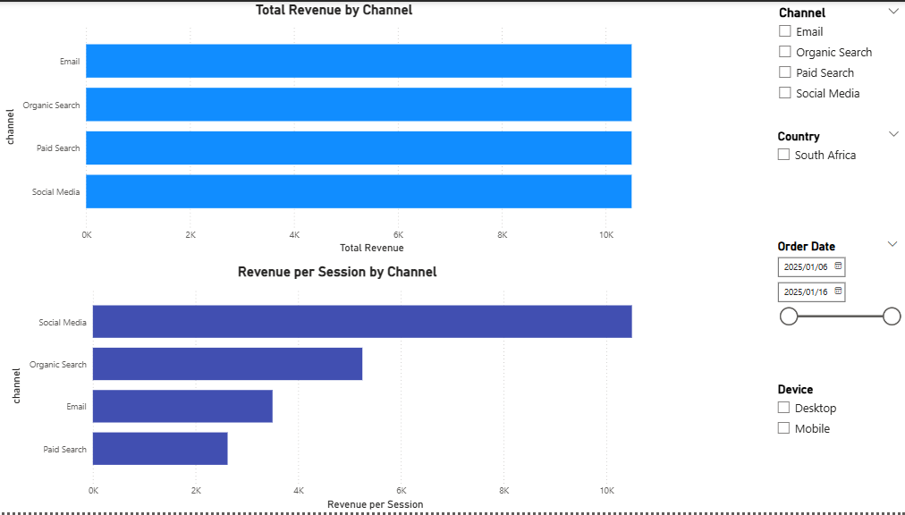
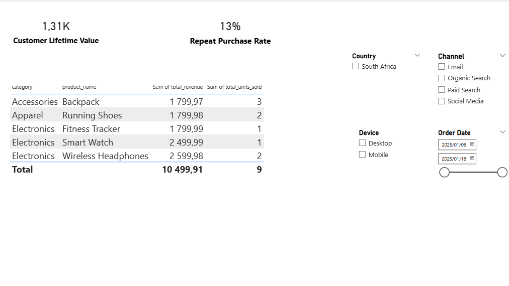

# Project 6: E-commerce Analytics Dashboard  
End-to-End SQL Server & Power BI Project

---

## Executive Summary
This project presents a comprehensive e-commerce analytics solution built using SQL Server and Power BI.  
It simulates a real-world digital marketing analytics workflow, transforming raw session and order data into actionable insights for revenue optimization and customer engagement.

The dashboard enables the analysis of:
- Revenue trends
- Conversion rates and funnel drop-offs
- Customer lifetime value
- Marketing channel performance
- Product-level sales insights

---

## Business Objectives
- Identify top-performing marketing channels and their ROI
- Analyze revenue trends over time
- Calculate conversion rate and repeat purchase behavior
- Determine high-value customers
- Evaluate product and category performance

---

## Data Model Overview

### Tables
- users  
- sessions  
- orders  
- order_items  
- products  

### Views
- vw_revenue_summary  
- vw_customer_lifetime_value  
- vw_channel_performance  
- vw_funnel_conversion  
- vw_product_performance  

### Relationships

This model separates **funnel data** (sessions) from **revenue data** (orders/order_items) and supports marketing and conversion analysis.

---

## Tools & Technologies
- SQL Server (T-SQL)
- Power BI
- DAX
- Git & GitHub
- VS Code

---

## Analytical Workflow

### 1. Data Creation & Preparation (SQL Server)
- Designed database schema from scratch
- Inserted realistic e-commerce data simulating sessions, orders, and multi-channel acquisition
- Ensured primary and foreign key integrity

### 2. Analytical Views (SQL)
Key views implemented:
- Revenue summary over time  
- Customer lifetime value (CLV)  
- Funnel conversion metrics  
- Marketing channel performance  
- Product revenue analysis  

### 3. Power BI Modeling & DAX
- Dedicated **Measures table** for calculations
- Key measures include:
  - `[Total Revenue]`
  - `[Total Orders]`
  - `[Total Sessions]`
  - `[Conversion Rate]`
  - `[Average Order Value]`
  - `[Revenue per Session]`
  - `[Customer Lifetime Value]`
  - `[Repeat Customers]`
  - `[Repeat Purchase Rate]`

---

## Dashboard Pages

### 1️⃣ Executive Overview
  
- KPI cards for Revenue, Orders, Conversion Rate, AOV, Revenue per Session  
- Line chart for revenue trends  
- Donut/bar chart for channel contribution

---

### 2️⃣ Funnel Analysis
  
- Funnel visual showing Sessions → Orders  
- Bar chart for conversion rate by channel

---

### 3️⃣ Marketing Performance
  
- Revenue by channel  
- Revenue per session by channel  

---

### 4️⃣ Customer & Product Insights
  
- Customer Lifetime Value (CLV)  
- Repeat Purchase Rate  
- Product-level revenue and units sold  

---

## Key Insights
- Paid Search and Email channels drive the highest conversions  
- A small group of customers generates the majority of revenue  
- Repeat customers have significantly higher lifetime value  
- Certain product categories consistently outperform others  
- Funnel analysis highlights drop-offs at the session-to-order stage  

---

## Repository Structure

---

## Future Enhancements
- Multi-year e-commerce trends  
- Channel-level ROI modeling  
- Advanced time-intelligence (YoY, MoM growth)  
- Customer segmentation with RFM analysis  
- Integrate web analytics data (clickstream)  

---

## Author
**Boiketlo Thabang Lorekang**  
Data Analyst | SQL • Power BI • Business Intelligence  

GitHub: [https://github.com/BoiketloTLorekang](https://github.com/BoiketloTLorekang)
